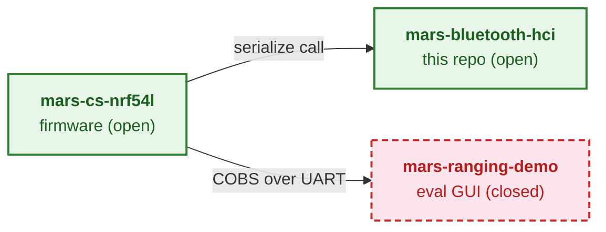

# MARS Bluetooth HCI

The open encoder, parser, and C-FFI bridge for the Metirionic Advanced Ranging Stack (MARS) — this repository defines the authoritative Channel Sounding wire format consumed by MARS firmware and the closed-source evaluation GUI.

## Where it fits

The Metirionic Channel Sounding product spans three repositories. [`mars-bluetooth-hci`](https://github.com/Metirionic/mars-bluetooth-hci) (this repo) and [`mars-cs-nrf54l`](https://github.com/Metirionic/mars-cs-nrf54l) (the nRF54L firmware) are open source under MIT; [`mars-ranging-demo`](https://github.com/Metirionic/mars-ranging-demo) is a public repo whose GUI decoder is closed-source. The Metirionic Advanced Ranging Stack (MARS) itself is a separately licensed product, not governed by these repositories. This library parses and serializes Channel Sounding measurement data; it does **not** compute ranging or distance.

<!-- The canonical, fully-annotated data flow lives in docs/ecosystem.md — keep this trimmed diagram in sync with that document. -->

For the full, annotated data flow (build-time `FetchContent` mechanics, the serialize call/return, and the UART transport), see [`docs/ecosystem.md`](docs/ecosystem.md).

## License

Licensed under the [MIT License](LICENSE).