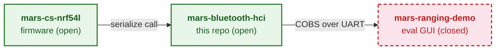

# Mars Bluetooth HCI

The open encoder, parser, and C-FFI bridge for the Metirionic Advanced
Ranging Stack (MARS) - this repository defines the authoritative Channel
Sounding wire format consumed by MARS firmware and the closed-source
evaluation GUI.

## Where it fits

The MARS Channel Sounding ecosystem spans three repositories: `mars-cs-nrf54l`
firmware is open, `mars-bluetooth-hci` is this open library, and
`mars-ranging-demo` is a public repository with a closed-source evaluation GUI.
MARS is separately licensed from those repositories. This library parses and
serializes Channel Sounding measurement data and defines the wire format
between firmware and GUI; it does not compute ranging or distance.

<!--
docs/ecosystem.md is the canonical, fully annotated data-flow source; keep this
landing diagram in sync.
-->

For the full annotated ecosystem data flow, see
[docs/ecosystem.md](docs/ecosystem.md).

## License

Licensed under the [MIT License](LICENSE).
