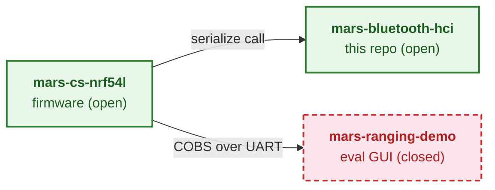

# MARS Bluetooth HCI

The open encoder, parser, and C-FFI bridge for the Metirionic Advanced Ranging Stack (MARS) — this repository defines the authoritative Channel Sounding wire format consumed by MARS firmware and the closed-source evaluation GUI.

## Where it fits

The Metirionic Channel Sounding product spans three repositories. [`mars-bluetooth-hci`](https://github.com/Metirionic/mars-bluetooth-hci) (this repo) and [`mars-cs-nrf54l`](https://github.com/Metirionic/mars-cs-nrf54l) (the nRF54L firmware) are open source under MIT; [`mars-ranging-demo`](https://github.com/Metirionic/mars-ranging-demo) is a public repo whose GUI decoder is closed-source. The Metirionic Advanced Ranging Stack (MARS) itself is a separately licensed product, not governed by these repositories. This library parses and serializes Channel Sounding measurement data; it does **not** compute ranging or distance.

<!-- The canonical, fully-annotated data flow lives in docs/ecosystem.md — keep this trimmed diagram in sync with that document. -->



For the full, annotated data flow (build-time `FetchContent` mechanics, the serialize call/return, and the UART transport), see [`docs/ecosystem.md`](docs/ecosystem.md).

## What's inside

 [](LICENSE)

| Crate | Badges | Description |
|-------|--------|-------------|
| [`mars-bluetooth-hci`](mars-bluetooth-hci/README.md) | [](https://crates.io/crates/mars-bluetooth-hci) [](https://docs.rs/mars-bluetooth-hci) | Parses HCI LE CS subevent-result events (`0x31` config, `0x32` subevent-result) and serializes them over a C FFI. |
| [`mars-common`](mars-common/README.md) | [](https://crates.io/crates/mars-common) [](https://docs.rs/mars-common) | Shared FFI-safe `SerializedData` buffer, `drop_bin`, C allocator/panic bridges, and `log`/`defmt` logging dispatch. |

- `no_std` + embedded — bare-metal Cortex-M (e.g. `thumbv6m-none-eabi`), `panic = "abort"` compatible → `docs/c-embedded-integration.md`.
- Serialize-only FFI — serialization and memory management only cross the C boundary (no `parse_*`/`decode_*`/`deserialize_*`); the HCI parser is a Rust-API concern → `docs/adr/0002-serialize-only-ffi.md`.
- `postcard` + COBS wire format — self-framing, trailing-`0x00`-delimited; this repo is the authoritative spec → `docs/wire-format.md`, `docs/adr/0001-wire-format-postcard-cobs.md`.
- CMake / `FetchContent` — pre-generated C header + `mars-bluetooth-hci-rust-config.cmake`, including cross-compilation → `docs/c-embedded-integration.md`.

## Quick start

The real consumer path — serialize a Channel Sounding subevent-result event over the C FFI and hand the COBS-framed bytes to UART (matches the generated header `mars-bluetooth-hci/mars_bluetooth_hci.h`):

```c
SubeventResultEvent_t event = { /* from the CS controller */ };

SerializedData_t buf =
    serialize_subevent_result_event(&event, /*use_cobs=*/true);
/* buf.p_data / buf.size : COBS-framed postcard + trailing 0x00 */

uart_tx(buf.p_data, buf.size);
drop_bin(buf);                        /* free when done */
```

For the full build/link + FFI walkthrough, see [`docs/c-embedded-integration.md`](docs/c-embedded-integration.md). For the Rust parser API, see the [`mars-bluetooth-hci`](mars-bluetooth-hci/README.md) sub-README and [docs.rs](https://docs.rs/mars-bluetooth-hci).

## Go deeper

| Document | Covers |
|----------|--------|
| [`docs/ecosystem.md`](docs/ecosystem.md) | three-repo split, open/closed boundary, full data flow |
| [`docs/architecture.md`](docs/architecture.md) | internal architecture, HCI→UART sequence |
| [`docs/wire-format.md`](docs/wire-format.md) | envelope, postcard, COBS framing, trailing 0x00 |
| [`docs/c-embedded-integration.md`](docs/c-embedded-integration.md) | C FFI + CMake, cross-compilation |
| [`docs/adr/`](docs/adr/) | architecture decision records |
| [`CONTRIBUTING.md`](CONTRIBUTING.md) | build, headers, release flow |

## License

Licensed under the [MIT License](LICENSE).