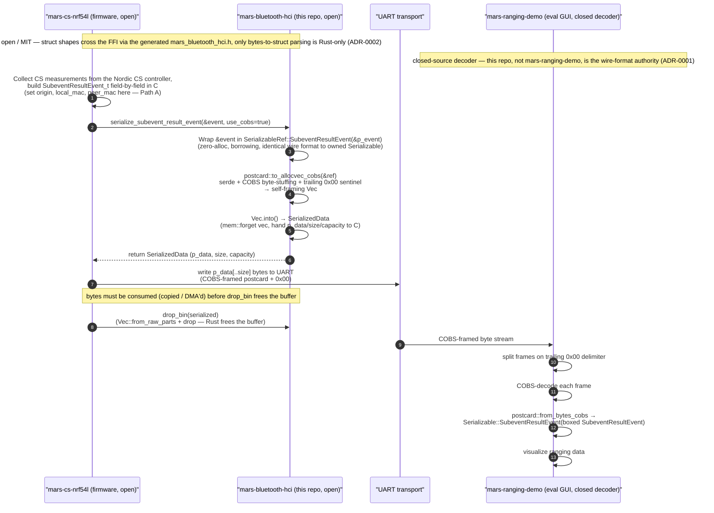

# Architecture overview

This document is the detailed, human-facing architecture of `mars-bluetooth-hci` — the HOW underneath [ecosystem.md](ecosystem.md) (the WHAT) and the two ADRs (the WHY): [ADR-0001](adr/0001-wire-format-postcard-cobs.md) (wire format) and [ADR-0002](adr/0002-serialize-only-ffi.md) (serialize-only FFI). It is the detailed counterpart to the concise [`CONTEXT.md`](../CONTEXT.md), which links here rather than duplicating this content. It is written for the PRD #3 audience, in priority order: prospective MARS licensees, C/embedded integrators, Rust crate users, and contributors.

## System context

`mars-bluetooth-hci` is a two-crate Rust workspace — see [ecosystem.md](ecosystem.md) for the three-repo picture and the ecosystem data-flow diagram, which this document does not reproduce. The two crates:

- `mars-bluetooth-hci` (v0.8.0) — the encoder, parser, and serialize-only C FFI for Bluetooth HCI Channel Sounding subevent-result events. Built as both a `lib` (Rust API) and a `staticlib` (`libmars_bluetooth_hci.a`, which is what the firmware links).
- `mars-common` (v0.2.0) — shared FFI infrastructure and logging dispatch (`SerializedData` buffer, `drop_bin`, allocator/panic bridges, `log`/`defmt`).

The production consumer is `mars-cs-nrf54l` (open nRF54L firmware), which builds the event struct in C and serializes it for UART. The decoder is `mars-ranging-demo` (a public repo with a closed-source GUI), which receives the UART stream and deserializes it. This repo is the **encode side**; the decode side is closed-source, so this repo — not `mars-ranging-demo` — is the authoritative source for the wire-format contract (ADR-0001).

## The serialize-only FFI boundary

The C FFI surface (generated via `safer-ffi` `#[ffi_export]` into `mars_bluetooth_hci.h`) exposes only serialization and memory management for the HCI data path — four symbols, and nothing else:

| Symbol | Role | Source |
|---|---|---|
| `serialize_subevent_result_event` | Serialize a `&SubeventResultEvent` into a `SerializedData` buffer, optionally COBS-encoded. | `mars-bluetooth-hci/src/libc.rs:49` |
| `serialize_log_message` | Serialize a C-string log message into a `SerializedData` buffer, optionally COBS-encoded. | `mars-bluetooth-hci/src/libc.rs:64` |
| `drop_bin` | Free a `SerializedData` buffer that Rust allocated. | `mars-common/src/libc/serialize.rs:105` |
| `new_dummy_data` | Allocate deterministic bring-up bytes (optionally COBS-encoded) — a test/bring-up helper, not part of the HCI→UART path. | `mars-common/src/libc/serialize.rs:83` |

There is **no** `parse_*`/`decode_*`/`deserialize_*` symbol. The HCI parser — `impl TryFrom<&[u8]> for SubeventResultEvent` (`mars-bluetooth-hci/src/event/hci_le_cs/subevent_result.rs`) together with `ParseError` — is a Rust-API-only concern, deliberately kept off the C surface so the parser's memory safety and error handling stay in Rust (ADR-0002).

The key distinction is what does and does not cross the FFI: the **struct shapes** cross it — `SubeventResultEvent`, `Step`, `ModeRoleSpecificInfo`, `Mode2`, and friends are `#[derive_ReprC]`/`#[repr(C)]`, so they appear in the generated header and C can construct them directly — but the **bytes→struct parsing behavior** does not. C builds the struct; Rust serializes it. The header is generated, not hand-written; see [../CONTRIBUTING.md](../CONTRIBUTING.md) §1 for the regeneration contract.

## Two ways to build a SubeventResultEvent

There are two construction paths for the `SubeventResultEvent` struct. ADR-0002 names them Path A and Path B; this section elaborates without re-arguing the decision.

### Path A — firmware, C-side step-parse

This is the production path used by `mars-cs-nrf54l`. The firmware collects Channel Sounding measurements from the Nordic CS controller and builds the `SubeventResultEvent_t` C struct directly, field by field — header fields, each `Step` and its `ModeRoleSpecificInfo`/`Mode2`, and the identity fields (`origin`, `local_mac`, `peer_mac`) — then calls `serialize_subevent_result_event(&event, use_cobs=true)`. The library never sees raw HCI bytes on this path; it receives an already-assembled struct and serializes it. The firmware's side of this flow (how it collects measurements and assembles the struct) is documented in the [sibling firmware's architecture](https://github.com/Metirionic/mars-cs-nrf54l/blob/main/docs/architecture.md).

### Path B — Rust parse-from-bytes (Rust API only)

This is the decode-side path, available only to Rust consumers. `impl TryFrom<&[u8]> for SubeventResultEvent` (`subevent_result.rs:324`) parses raw HCI subevent bytes: it handles subevent codes `0x31` (`CS_CONFIG_COMPLETE`) and `0x32` (`CS_SUBEVENT_RESULT_CONTINUE`), decodes the header fields, and `push_steps` (`subevent_result.rs:239-288`) walks the per-step byte layout. It is consumed by the file-reader helper `read_file` (`mars-bluetooth-hci/src/event/hci_le_cs/hci_file_reader.rs:43`) and by tests/doctests.

A precision note on availability: the parser itself is **Rust-API-only and no_std-compatible** — the `impl TryFrom<&[u8]>` is not cfg-gated and compiles without `std` (it uses `core::array::from_fn`, core `try_into`, and `Result`). What is `#[cfg(any(feature = "std", test))]`-gated is its *convenience caller*, the `hci_file_reader` module, which reads a vendor text format from disk. The parser is not exported across the FFI in any configuration.

### Path A vs Path B

| | Path A (firmware) | Path B (Rust parse) |
|---|---|---|
| Where the struct is built | In C, by the firmware, from CS measurements | In Rust, by `TryFrom<&[u8]>`, from raw HCI bytes |
| What crosses the FFI | The assembled `&SubeventResultEvent` (struct shape); bytes go out | Nothing — Rust-API-only, never crosses the FFI |
| Who sets `origin`/`local_mac`/`peer_mac` | The firmware, in C, before the call | The caller, after parsing, from out-of-band context |
| Exported across the FFI? | Yes (via `serialize_subevent_result_event`) | No |
| Gating | Always available on the FFI (`libc` feature) | Parser: always (no_std); `hci_file_reader` caller: `std`/test |

## mars-common

`mars-common` provides the FFI infrastructure that the serialize surface stands on. Four responsibilities:

- **`SerializedData`** — the FFI-safe `#[repr(C)]` buffer (`p_data: *mut u8`, `size`, `capacity`) that carries serialized bytes across the FFI. Ownership is handed to C without copying: `From<Vec<u8>>` takes the vec's pointer/length/capacity and `mem::forget`s the vec, so the buffer is handed to C un-freed; `From<SerializedData> for Vec<u8>` reclaims it with `Vec::from_raw_parts` (this is what `drop_bin` uses); `From<&SerializedData> for &[u8]` views it as a slice. (`mars-common/src/libc/serialize.rs`)
- **`drop_bin`** — the matching free function. It reclaims any buffer Rust allocated (a `SerializedData` returned by the serialize functions or `new_dummy_data`). C must call it exactly once per returned buffer; not freeing leaks, double-freeing is undefined behavior.
- **Allocator and panic bridges** — under the `libc-alloc` feature, `mars-common` installs a `#[global_allocator]` that forwards Rust allocations to C `malloc`/`free` (`mars-common/src/libc/alloc.rs`), so the `Vec<u8>` the serializer produces is allocated in C's heap and `drop_bin`'s `free` matches. Under `libc-panic`, a `#[panic_handler]` formats the panic into a `CString` and calls a C-provided `rust_panic_cb` callback, then loops (`mars-common/src/libc/panic.rs`). (There is also an Android-only `rust_eh_personality` stub for linking — an Android-only concern, not part of the data path.)
- **Logging dispatch** — `mars-common/src/fmt.rs` dispatches `log` or `defmt` (mutually exclusive — a `compile_error!` fires if both are enabled), and provides `assert!`/`unwrap!`/etc. macros that become no-ops when neither logging feature is on.

See [mars-common/README.md](../mars-common/README.md) for the feature-flag reference; the `no_std`/embedded feature matrix lives in [../CONTRIBUTING.md](../CONTRIBUTING.md) §3.

## Serialization flow

The encode path from an in-memory event struct to bytes (`mars-bluetooth-hci/src/libc.rs`):

1. The caller passes `&SubeventResultEvent` to `serialize_subevent_result_event(p_event, use_cobs)`.
2. It is wrapped in `SerializableRef::SubeventResultEvent(p_event)` — a borrowing enum so the ~8 KB struct is not cloned or heap-allocated. `SerializableRef` produces an identical wire format to the owned `Serializable` enum (asserted by the `log_message_wire_format_matches` test).
3. It is serialized with `postcard::to_allocvec_cobs` (the `use_cobs=true` path: serde + COBS byte-stuffing + a trailing `0x00` sentinel fused into one call, so the stream is self-framing with no out-of-band framing) or `postcard::to_allocvec` (the `use_cobs=false` path: plain postcard, no COBS, no `0x00` — a deliberate unframed variant for non-streaming/recording use; see ADR-0001).
4. The `Vec<u8>` is converted into `SerializedData` via `.into()`, which `mem::forget`s the vec and hands the raw pointer/length/capacity to C.
5. The caller frees the buffer via `drop_bin`.

The envelope on the wire is the `SerializableRef`/`Serializable` enum (`SubeventResultEvent` or `LogMessage` variant) — the receiver deserializes the enum and dispatches accordingly. There is **no in-band version or magic byte** in the envelope today; versioning is currently by git-tag co-pinning of the library with paired firmware/evaluation-app releases. Whether to add an in-band version/magic byte is an open decision (#15; see [wire-format.md](wire-format.md) §Versioning and compatibility).

For the byte-level wire-format detail (envelope layout, COBS framing, the trailing-zero delimiter, the `use_cobs=false` variant), see [ADR-0001](adr/0001-wire-format-postcard-cobs.md) for the decision and [wire-format.md](wire-format.md) for the authoritative contract.

## End-to-end sequence

The diagram shows the full Path A, `use_cobs=true` flow — from the firmware collecting HCI measurements, through serialization and the `SerializedData` ownership handoff, over UART, to the closed-source decoder. The firmware and this library are open (MIT); the decoder is closed-source (this repo remains the wire-format authority — ADR-0001).

1. **Build (firmware):** the firmware collects CS measurements from the Nordic controller and builds `SubeventResultEvent_t` in C, setting the identity fields (`origin`, `local_mac`, `peer_mac`) itself — Path A.
2. **Serialize (call):** the firmware calls `serialize_subevent_result_event(&event, use_cobs=true)`.
3. **Serialize (library):** the library wraps the event in `SerializableRef`, runs `postcard::to_allocvec_cobs` (postcard + COBS + trailing `0x00`), and returns a `SerializedData` — the `Vec` is `mem::forget`-en, and its pointer/length/capacity go to C.
4. **Consume + free:** the firmware writes `p_data[..size]` to UART (copying or DMA'ing the bytes first), then calls `drop_bin` to reclaim the buffer. The bytes must be consumed before `drop_bin` frees them.
5. **Transport:** the COBS-framed binary crosses UART.
6. **Decode:** `mars-ranging-demo` receives the stream, splits frames on the trailing `0x00`, COBS-decodes each frame, postcard-deserializes it into `Serializable::SubeventResultEvent`, and visualizes the ranging data. The decode side runs in the closed-source GUI; the sibling firmware doc covers the firmware's UART mechanism.

## Known limitations

- **Identity fields are caller-set by design.** The parser (`impl TryFrom<&[u8]> for SubeventResultEvent`, `subevent_result.rs:324`) populates every field it can decode from the HCI bytes but leaves `origin`, `local_mac`, and `peer_mac` at their defaults (`Origin::Unknown` / `0`) — the raw subevent bytes do not carry node identity. The caller fills them from out-of-band context. In Path B the file-reader helper `read_file` (`hci_file_reader.rs:43`) sets `origin` from the vendor text format's `requester`/`reflector` label after parsing; in Path A the firmware sets all three directly in C before calling `serialize_subevent_result_event`. This is intentional, not a parser bug.
- **Only Mode 2 step data is decoded.** `push_steps` (`subevent_result.rs:239-288`) fully decodes `MODE_2` step data, recognizes `MODE_0` but carries no step data from it (a no-op), and returns `ParseError::InvalidModeType` for `MODE_1` and `MODE_3`. The `ModeRoleSpecificInfoKind` `#[repr(u8)]` enum nonetheless enumerates every mode/role variant so the C enum in the generated header stays forward-compatible — those variants exist for ABI completeness, not because the parser populates them. Implementing the remaining modes is tracked in #9.

## Related documents

- [ecosystem.md](ecosystem.md) — the three-repo WHAT and the ecosystem data-flow diagram; this document is the detailed HOW underneath it.
- [adr/0001-wire-format-postcard-cobs.md](adr/0001-wire-format-postcard-cobs.md) — the wire-format decision (postcard + COBS, the `0x00` sentinel, the `use_cobs=false` unframed variant, encode-only/decode-closed boundary).
- [adr/0002-serialize-only-ffi.md](adr/0002-serialize-only-ffi.md) — the serialize-only FFI decision and the two event-struct construction paths (Path A / Path B) at the decision level.
- [../CONTRIBUTING.md](../CONTRIBUTING.md) §1 — the generated-header regeneration contract; §3 — the `no_std`/embedded feature matrix; §6 — the documentation structure and Mermaid convention.
- [c-embedded-integration.md](c-embedded-integration.md) — the detailed integrator walkthrough for building/linking the static library and the FFI call pattern; this document is the high-level FFI/Path-A counterpart.
- [mars-cs-nrf54l docs/architecture.md](https://github.com/Metirionic/mars-cs-nrf54l/blob/main/docs/architecture.md) — the firmware's internal ranging-data flow; defers the COBS wire format and the `mars-bluetooth-hci` API to this repo.
- [Bluetooth SIG Channel Sounding overview](https://www.bluetooth.com/channel-sounding-tech-overview/) — the technology background this document deliberately does not reproduce.