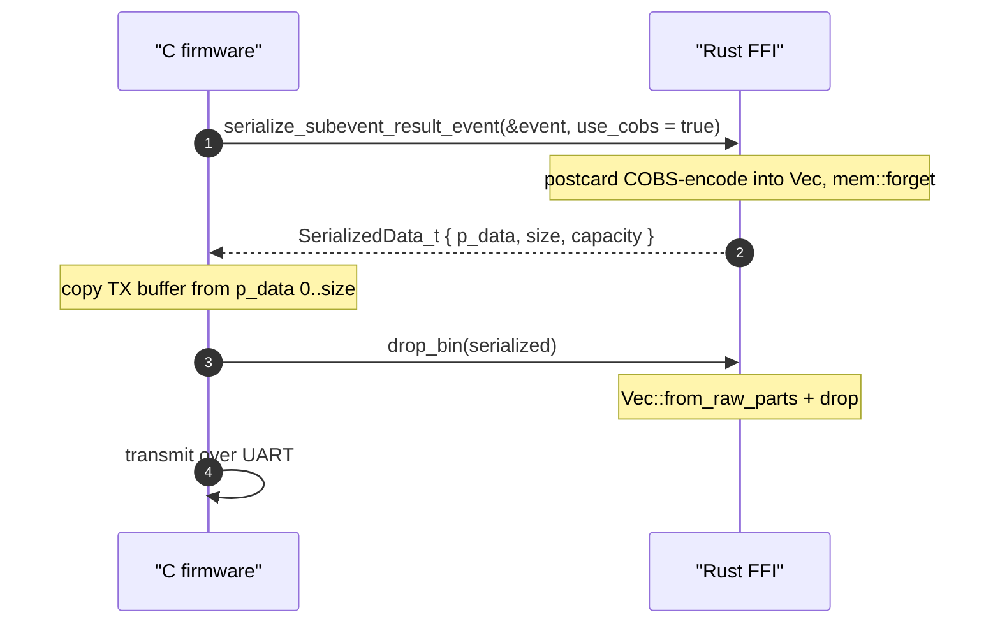

# C/embedded integration guide

This document is the integrator walkthrough for embedding the `mars-bluetooth-hci`
[Encoder](../CONTEXT.md#library-boundary) as a static library in ARM `no_std` firmware —
the detailed HOW-TO counterpart to [architecture.md](architecture.md)'s
high-level FFI and Path-A description. It sits underneath [ecosystem.md](ecosystem.md)
(the WHAT), [architecture.md](architecture.md) (the HOW), the two ADRs (the WHY):
[ADR-0001](adr/0001-wire-format-postcard-cobs.md) (wire format) and
[ADR-0002](adr/0002-serialize-only-ffi.md) (serialize-only FFI), and
[wire-format.md](wire-format.md) (the byte-level CONTRACT). It is written for the
PRD #3 audience, specifically C/embedbedded integrators — firmware engineers
linking `libmars_bluetooth_hci.a` into a Cortex-M target via the provided CMake
config. It cross-links to those documents rather than restating them
([../CONTRIBUTING.md](../CONTRIBUTING.md) §6: cross-link rather than duplicate).

## Scope and audience

This guide covers the two things an embedded integrator needs that the sibling
documents do not spell out step by step:

- **Building and linking** the Rust static library (`libmars_bluetooth_hci.a`)
  for an ARM `no_std` target through the provided CMake config.
- **The FFI call pattern** — construct the event struct in C, serialize with
  COBS on, copy the returned buffer, free it, then transmit (Path A in
  [architecture.md](architecture.md)).

It does **not** cover the wire byte layout (see [wire-format.md](wire-format.md)),
the Rust API or the HCI parser (see [architecture.md](architecture.md)), the
decoder side (closed-source; see [ecosystem.md](ecosystem.md)), or Bluetooth
Channel Sounding itself (see the [Bluetooth SIG overview](https://www.bluetooth.com/channel-sounding-tech-overview/)).

## Prerequisites and target assumptions

- A Rust toolchain with your ARM target installed, e.g.
  `rustup target add thumbv6m-none-eabi` (the canonical example used throughout
  this repo; substitute your own `${RUST_TARGET}`).
- A C/CMake build that can `include()` the provided package-config module and
  link a static library.
- A C `malloc`/`free` pair and a `rust_panic_cb` callback (see
  [Embedded constraints you must provide](#embedded-constraints-you-must-provide)) —
  the `libc-alloc` and `libc-panic` features push these onto the integrator.
- `panic = "abort"` for the release profile. **This repo does not set it**: the
  workspace `[profile.release]` (`Cargo.toml:10-14`) sets `lto`, `codegen-units`,
  `strip`, and `opt-level` but has **no `panic` key**, so the integrator must
  inject it (see the lever under
  [Embedded constraints you must provide](#embedded-constraints-you-must-provide)).

The `no_std` build and the manual `cargo check` commands live in
[../CONTRIBUTING.md](../CONTRIBUTING.md) §3; this guide links them rather than
copying them.

## The embedded feature set

Build the static library with exactly the feature set the CMake config uses
when `HOST` is off ([`mars-bluetooth-hci/mars-bluetooth-hci-rust-config.cmake`](../mars-bluetooth-hci/mars-bluetooth-hci-rust-config.cmake)):

```
--no-default-features --features libc,alloc,libc-panic,libc-alloc
```

| Feature      | What it gates                                                                                                          | Source |
|--------------|------------------------------------------------------------------------------------------------------------------------|--------|
| `libc`       | The C FFI surface — the `#[ffi_export]` items (`pub mod libc;` is feature-gated).                                       | `mars-bluetooth-hci/src/lib.rs:9-10` |
| `alloc`      | `postcard`'s `alloc` feature, so the serializer can produce a heap `Vec<u8>`.                                           | `mars-bluetooth-hci/Cargo.toml:36` |
| `libc-alloc` | Implies `libc`. Installs a `#[global_allocator]` that forwards to C `malloc`/`free`.                                   | `mars-common/src/libc/alloc.rs` |
| `libc-panic` | Implies `libc`. Installs a `#[panic_handler]` that calls a C-provided `rust_panic_cb`.                                  | `mars-common/src/libc/panic.rs` |

`libc-alloc` and `libc-panic` each imply `libc`, so listing `libc` explicitly is
harmless and is the convention the CMake config and the crate README use. With
`std` off and not a test build, both crates are `#![no_std]`
(`#![cfg_attr(all(not(test), not(feature = "std")), no_std)]` at
`mars-bluetooth-hci/src/lib.rs:2` and `mars-common/src/lib.rs:2`). For the full
feature-flag reference, see [`mars-bluetooth-hci/README.md`](../mars-bluetooth-hci/README.md)
and [`mars-common/README.md`](../mars-common/README.md); for the manual
cross-compile commands, see [../CONTRIBUTING.md](../CONTRIBUTING.md) §3.

## Building and linking the static library

There is no top-level `CMakeLists.txt` in this repo. The build seam is a CMake
package-config module,
[`mars-bluetooth-hci/mars-bluetooth-hci-rust-config.cmake`](../mars-bluetooth-hci/mars-bluetooth-hci-rust-config.cmake),
which the consumer `include()`s from its own `CMakeLists.txt`. The consumer
defines `RUST_TARGET` and `HOST` before the `include()`.

### Consumer CMake snippet

```cmake
set(RUST_TARGET "thumbv6m-none-eabi")   # your ARM target
set(HOST OFF)                            # OFF => embedded feature set

include(${PATH_TO_mars-bluetooth-hci}/mars-bluetooth-hci/mars-bluetooth-hci-rust-config.cmake)

target_link_libraries(${FW_TARGET} PRIVATE mars_bt_hci_rust)
add_dependencies(${FW_TARGET} build_mars_bt_hci_rust)
```

### What the config does for you

- It sets `CARGO_TARGET_DIR` to `${CMAKE_BINARY_DIR}/cargo-target`, so the
  `.a` lands in your build tree, not in this repo's `target/`.
- It picks the cargo features from `HOST`: `HOST` on → default features (host);
  `HOST` off → `--no-default-features --features libc,alloc,libc-panic,libc-alloc`
  (the embedded set above).
- It runs `cargo build --lib --target ${RUST_TARGET} --release --target-dir ${CARGO_TARGET_DIR} ${FEATURES}`
  (the `--lib` flag is required because the header-generator bin uses `std`).
- It resolves the artifact to
  `${CARGO_TARGET_DIR}/${RUST_TARGET}/release/libmars_bluetooth_hci.a` and exposes
  it as an imported `STATIC` `GLOBAL` CMake target, `mars_bt_hci_rust`.
- Link libraries are published in `MARS_BT_HCI_RUST_LINK_LIBRARIES`; the build
  is driven by the `build_mars_bt_hci_rust` custom target.
- If `MARS_BT_HCI_RUST_CONFIG_PATH` is defined, the cargo invocation is wrapped
  in that env var — a runtime-config hook for the firmware.

### Choosing the target triple

The target triple is **not pinned** by this repo — the consumer chooses it via
the `RUST_TARGET` CMake variable ([../CONTRIBUTING.md](../CONTRIBUTING.md) §3).
`thumbv6m-none-eabi` (Cortex-M0+) is the example used throughout the repo's docs;
substitute your own target.

### FetchContent model

The production consumer, the Nordic nRF54L firmware `mars-cs-nrf54l`, pulls this
library in via CMake `FetchContent` pinned to a tagged release; the pin lives in
the firmware (not here). See [ecosystem.md](ecosystem.md) for the three-repo
picture and [Canonical consumer reference](#canonical-consumer-reference) for
the exact pin.

## Embedded constraints you must provide

The `libc-alloc` and `libc-panic` features install a Rust `#[global_allocator]`
and `#[panic_handler]` that call back into C. You **must** provide these symbols
or the static library will not link.

### Global allocator: `malloc` / `free`

Under `libc-alloc`, `mars-common` installs a `#[global_allocator]` that forwards
Rust allocations to C `malloc`/`free` (`mars-common/src/libc/alloc.rs`). Provide
them:

```c
#include <stddef.h>

/* Required by the libc-alloc feature: the crate installs a #[global_allocator]
 * that calls these. If your firmware already has libc malloc/free, just make
 * them link-visible. */
void *malloc(size_t len) { return my_heap_alloc(len); }   /* your heap */
void  free(void *ptr)    { my_heap_free(ptr); }
```

> **Caveat (no fix proposed here):** the `Allocator::alloc` impl passes only
> `layout.size()` to `malloc`, ignoring `layout.align()` (`mars-common/src/libc/alloc.rs`).
> The serialized payload is a `Vec<u8>` (element align 1), so this is safe for the
> data path; flag it if your `malloc` returns under-aligned memory for other
> allocations. Fixing the alignment is out of scope for this guide.

### Panic handler: `rust_panic_cb`

Under `libc-panic`, `mars-common` installs a `#[panic_handler]` that formats the
`PanicInfo` into a `CString` and calls a C-provided `rust_panic_cb`, then loops
forever (`mars-common/src/libc/panic.rs`). `serialize_subevent_result_event`
`.unwrap()`s on a serialization failure, so a panic is the real failure path —
this callback is not cosmetic. Provide it:

```c
/* Required by the libc-panic feature: called by the Rust panic handler with a
 * NUL-terminated message. It does not return. */
void rust_panic_cb(const char *msg)
{
    /* log / abort / reset per your firmware policy */
    for (;;) { }
}
```

### `panic = "abort"`

Embedded builds require `panic = "abort"` in the release profile
([../CONTRIBUTING.md](../CONTRIBUTING.md) §3). This repo does **not** set it
(`Cargo.toml:10-14` has no `panic` key). Inject it into the cargo build the
CMake config invokes, without editing this repo:

```bash
export CARGO_PROFILE_RELEASE_PANIC=abort
```

(Or set `panic = "abort"` in the consumer's Cargo profile if you drive the build
from there.)

## The FFI call pattern

The C FFI surface is serialize-only ([ADR-0002](adr/0002-serialize-only-ffi.md)):
four symbols, no `parse_*`/`decode_*` (see [architecture.md](architecture.md) for
the boundary and the full end-to-end sequence). The integrator-relevant call
pattern is four steps:

1. **Construct** the event struct in C — zero-init `SubeventResultEvent_t` on the
   stack and populate its fields directly. There is no C constructor, and the
   identity fields (`origin`, `local_mac`, `peer_mac`) are caller-set by design.
2. **Serialize** with COBS on:
   `serialize_subevent_result_event(&event, /*use_cobs=*/true)`
   (`mars-bluetooth-hci/src/libc.rs:49`) returns a `SerializedData_t` by value.
3. **Copy** the framed bytes out of the returned buffer (`p_data[0..size]`)
   **before** freeing — `p_data` is invalid after the free.
4. **Free** the Rust-owned buffer exactly once with `drop_bin`
   (`mars-common/src/libc/serialize.rs:105`), then transmit your copy.



([architecture.md](architecture.md) has the full HCI-to-UART sequenceDiagram;
this is the FFI-only slice an integrator writes.)

### SerializedData ownership

`SerializedData` is `#[repr(C)]` (`mars-common/src/libc/serialize.rs:14`):

```c
typedef struct SerializedData {
    uint8_t * p_data;   /* pointer to the serialized bytes */
    size_t size;        /* number of valid bytes            */
    size_t capacity;    /* allocated capacity in bytes       */
} SerializedData_t;
```

Rust allocates the `Vec<u8>`, `mem::forget`s it, and hands the raw pointer,
length, and capacity to C. The buffer is a Rust allocation — **free it with
`drop_bin`, never with C `free`** (the header notes this at
`mars_bluetooth_hci.h:23-24`). `drop_bin` reconstructs the `Vec` via
`Vec::from_raw_parts(p_data, size, capacity)` and drops it. Call it **exactly
once** per returned buffer — a double-free is undefined behavior. The bytes on
the wire are the `SerializableRef` enum tag followed by the event payload, COBS-
framed when `use_cobs=true`; see [wire-format.md](wire-format.md) for the
authoritative byte layout and the `use_cobs=true` / `use_cobs=false` framing
variants.

## Minimal C example

A representative single Mode-2 step — not all 160. See
[Canonical consumer reference](#canonical-consumer-reference) for the real,
complete population of every step.

```c
#include "mars_bluetooth_hci.h"   /* committed at mars-bluetooth-hci/mars_bluetooth_hci.h */
#include <string.h>
#include <stdint.h>

/* You MUST provide these C symbols (see "Embedded constraints you must provide"):
 *   void *malloc(size_t len); void free(void *ptr); void rust_panic_cb(const char *); */
static void transmit_uart(const uint8_t *buf, size_t len);            /* firmware-defined */

/* TX scratch must hold the worst-case framed payload. SubeventResultEvent_t is
 * ~8 KB (steps: Step_t idx[160]); COBS adds at most ceil(size/254)+1 bytes plus
 * the 0x00 delimiter. Size this to YOUR real worst case, not this value. */
static uint8_t g_tx_buf[16 * 1024];

static int send_subevent(const SubeventResultEvent_t *event)
{
    /* 1. Serialize with COBS framing on (0x00-safe for the UART stream). */
    SerializedData_t out = serialize_subevent_result_event(event, /*use_cobs=*/true);

    /* serialize_subevent_result_event panics on failure (.unwrap()), so out is
     * either a valid buffer or you never get here — there is no errno path. */
    if (out.size > sizeof(g_tx_buf)) {        /* framed payload too large */
        drop_bin(out);
        return -1;
    }

    /* 2. Copy the framed bytes out BEFORE freeing. p_data is owned by Rust. */
    memcpy(g_tx_buf, out.p_data, out.size);
    size_t n = out.size;

    /* 3. Free the Rust-owned buffer exactly once. Do NOT call free() on p_data. */
    drop_bin(out);

    /* 4. Transmit. */
    transmit_uart(g_tx_buf, n);
    return 0;
}

static int build_and_send_local_event(uint64_t local_mac, uint64_t peer_mac,
                                      uint16_t conn_handle)
{
    /* Zero-init the ~8 KB struct on the stack; no C constructor. Identity fields
     * (origin/local_mac/peer_mac) are caller-set by design. */
    SubeventResultEvent_t event = {0};
    event.origin            = ORIGIN_INITIATOR;
    event.local_mac         = local_mac;
    event.peer_mac          = peer_mac;
    event.connection_handle = conn_handle;
    event.procedure_done_status = DONE_STATUS_ALL_COMPLETE;
    event.subevent_done_status  = DONE_STATUS_ALL_COMPLETE;
    event.antenna_path_count = 1;
    event.step_count        = 1;

    /* One representative Mode-2 step. See the canonical consumer for populating
     * all 160 entries; the full Step_t / Mode2_t layout is in mars_bluetooth_hci.h. */
    Step_t *s = &event.steps.idx[0];
    s->mode    = 2;          /* MODE_2 — the only mode the parser fully decodes */
    s->channel = 19;
    /* s->info.kind = MODE_ROLE_SPECIFIC_INFO_KIND_MODE2;  populate s->info.mode2 per Mode2_t */

    return send_subevent(&event);
}
```

> **Size the copy, do not truncate it.** A naïve fixed-size buffer smaller than
> the framed payload would silently truncate the ~8 KB event. Either size the TX
> scratch to the real worst case (as above, returning an error on overflow), or
> transmit directly from `p_data` via DMA and call `drop_bin` after the DMA
> completes — that avoids a second large buffer entirely.

## Canonical consumer reference

The reference consumer is the sibling firmware
[`mars-cs-nrf54l`](https://github.com/Metirionic/mars-cs-nrf54l) (open nRF54L
firmware; see [ecosystem.md](ecosystem.md)). The canonical implementation of the
FFI call pattern above is its **initiator serializer module**:

- [`initiator/src/serialize.c`](https://github.com/Metirionic/mars-cs-nrf54l/blob/main/initiator/src/serialize.c)
  — "Channel Sounding data serializer: parses local + peer step data into
  `SubeventResultEvent_t`, then calls the Rust COBS serializer."
  - The call site `serialize_subevent_result_event(event, use_cobs=true)` is at
    line 88.
  - `serialize_run()` (lines 115-197) fills `g_local_event` (`ORIGIN_INITIATOR`)
    and `g_peer_event` (`ORIGIN_REFLECTOR`).
  - The UART transmit is at line 189.
- The sibling [`docs/architecture.md`](https://github.com/Metirionic/mars-cs-nrf54l/blob/main/docs/architecture.md)
  documents the firmware's internal ranging-data flow and UART mechanism.
- The `FetchContent` pin is in
  [`initiator/CMakeLists.txt`](https://github.com/Metirionic/mars-cs-nrf54l/blob/main/initiator/CMakeLists.txt)
  (`GIT_TAG mars-bluetooth-hci@0.8.0`); the pin lives in the firmware, not here.

## When the header must be regenerated

[`mars-bluetooth-hci/mars_bluetooth_hci.h`](../mars-bluetooth-hci/mars_bluetooth_hci.h)
is **generated** by `safer-ffi`'s `headers` feature — it is not hand-written and
must not be edited by hand. **Any change to a public FFI type** — an item
annotated `#[ffi_export]` or `#[derive_ReprC]`, or anything else that affects the
generated header — **requires regenerating and committing `mars_bluetooth_hci.h`
in the same change**. Regenerate it with:

```bash
./mars-bluetooth-hci/generate_headers.sh mars-bluetooth-hci/mars_bluetooth_hci.h
```

CI's `header-check` job (`.github/workflows/ci.yml`) regenerates the header to a
temp file and `diff`s it against the committed copy — any difference fails CI.
The full contract, including what counts as a public-type change, is in
[../CONTRIBUTING.md](../CONTRIBUTING.md) §1; this guide points to it rather than
restating it.

## Edge cases and caveats

- **`panic = "abort"` is required and not set by this repo** — the workspace
  `[profile.release]` (`Cargo.toml:10-14`) has no `panic` key. Inject
  `CARGO_PROFILE_RELEASE_PANIC=abort` into the CMake-driven cargo build
  ([../CONTRIBUTING.md](../CONTRIBUTING.md) §3).
- **You must provide `malloc`/`free`**, or the static library will not link
  (`mars-common/src/libc/alloc.rs`).
- **You must provide `rust_panic_cb(const char*)`** (`mars-common/src/libc/panic.rs`).
  Because `serialize_subevent_result_event` `.unwrap()`s on failure, the panic
  callback is the failure path, not cosmetic.
- **Call `drop_bin` exactly once** per returned buffer; a double-free is
  undefined behavior. `drop_bin` takes `SerializedData_t` by value
  (`mars-common/src/libc/serialize.rs:105`).
- **Consume the bytes before `drop_bin`** — copy or DMA `p_data[0..size]` out
  first; `p_data` is invalid after the free.
- **Free with `drop_bin`, never C `free`** — the buffer is a Rust `Vec` whose
  allocation only Rust can release (`mars_bluetooth_hci.h:23-24`).
- **`use_cobs` on vs off** — `true` (`postcard::to_allocvec_cobs`) is the
  `0x00`-safe framed variant for UART streaming; `false`
  (`postcard::to_allocvec`) is unframed, for non-streaming use. Authoritative:
  [wire-format.md](wire-format.md); the WHY is [ADR-0001](adr/0001-wire-format-postcard-cobs.md).
- **No version or magic byte on the wire** — compatibility is by git-tag
  co-pinning of the library with paired firmware/decoder releases; see
  [wire-format.md](wire-format.md) §Versioning and compatibility.
- **No parser or decode symbol crosses the FFI** — the surface is serialize-only
  ([ADR-0002](adr/0002-serialize-only-ffi.md)); do not expect a `deserialize_*`.
  The Android-only `rust_eh_personality` stub is `target_os`-gated, not
  feature-gated, and is irrelevant to a Cortex-M build.
- **`SubeventResultEvent_t` is large (~8 KB; `steps: Step_t idx[160]`)** — mind
  stack usage on constrained targets; the canonical consumer fills static
  `g_local_event` / `g_peer_event` rather than a stack struct.

## Related documents

- [ecosystem.md](ecosystem.md) — the three-repo WHAT and the FetchContent consumer model.
- [architecture.md](architecture.md) — the HOW: the serialize-only FFI surface, Path A (firmware builds the struct in C), the `SerializedData` ownership handoff, and the full end-to-end HCI-to-UART sequence diagram (this guide is the detailed integrator counterpart to its FFI / Path-A description).
- [wire-format.md](wire-format.md) — the authoritative byte-level CONTRACT: the `SerializableRef` envelope, COBS framing and the `0x00` delimiter, the `use_cobs=true`/`false` variants, and versioning.
- [adr/0001-wire-format-postcard-cobs.md](adr/0001-wire-format-postcard-cobs.md) — the WHY for postcard + COBS and the encode-only / decode-closed boundary.
- [adr/0002-serialize-only-ffi.md](adr/0002-serialize-only-ffi.md) — the WHY for the serialize-only FFI and the Path A / Path B construction paths.
- [../CONTRIBUTING.md](../CONTRIBUTING.md) §1 — the generated-header regeneration contract; §3 — the `no_std`/embedded feature matrix and the manual `cargo check` commands; §6 — the documentation structure and the cross-link convention.
- [../mars-bluetooth-hci/mars_bluetooth_hci.h](../mars-bluetooth-hci/mars_bluetooth_hci.h) — the generated C header; canonical source for `SubeventResultEvent_t` field order and types, and the `SerializedData_t` / `drop_bin` / `serialize_subevent_result_event` declarations used in the example above.
- [../mars-bluetooth-hci/mars-bluetooth-hci-rust-config.cmake](../mars-bluetooth-hci/mars-bluetooth-hci-rust-config.cmake) — the CMake package-config module that builds and exposes `mars_bt_hci_rust`.
- [`mars-cs-nrf54l` initiator serializer](https://github.com/Metirionic/mars-cs-nrf54l/blob/main/initiator/src/serialize.c) — the canonical consumer implementation of the FFI call pattern.