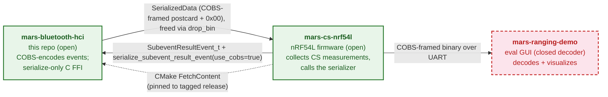

# Ecosystem overview

This document orients you to the three Metirionic Channel Sounding repositories and how data flows between them. It stays at the ecosystem level — it does not document Bluetooth Channel Sounding technology itself (see the [Bluetooth SIG Channel Sounding overview](https://www.bluetooth.com/channel-sounding-tech-overview/)), the internal function-level architecture of this library (see [docs/architecture.md](architecture.md)), or the firmware's internals (see the sibling firmware's [docs/architecture.md](https://github.com/Metirionic/mars-cs-nrf54l/blob/main/docs/architecture.md)).

## The three repositories

The Metirionic Channel Sounding product spans three repositories, each with a distinct responsibility:

### mars-bluetooth-hci (this repo)

The open encoder, parser, and C-FFI bridge for the Metirionic Advanced Ranging Stack (MARS) — a separately licensed ranging stack. The workspace ships two crates: `mars-bluetooth-hci`, which parses Bluetooth HCI Channel Sounding subevent-result events on the Rust side and exposes a **serialize-only** C FFI for embedded consumers, and `mars-common`, which provides the shared FFI-safe `SerializedData` buffer, the `drop_bin` free function, the C `malloc`/`free` allocator bridge, the panic bridge, and `log`/`defmt` logging dispatch. Across the FFI the firmware constructs an FFI-safe `SubeventResultEvent_t` in C and calls `serialize_subevent_result_event(..., use_cobs=true)` to receive a COBS-framed postcard byte buffer; the HCI parser itself is a Rust-API-only concern and is deliberately not exported across the FFI. Licensed under MIT.

Repo: [mars-bluetooth-hci](https://github.com/Metirionic/mars-bluetooth-hci) — **open**.

### mars-cs-nrf54l

The Nordic nRF54L Channel Sounding sample firmware and the reference consumer of this library. It runs on nRF54L hardware, collects Channel Sounding measurement data from the Nordic CS controller, builds the `SubeventResultEvent_t` in C, calls this library's serializer, and transmits the COBS-framed binary over UART. It consumes `mars-bluetooth-hci` via CMake `FetchContent` pinned to a tagged release — the pin lives in the firmware, not in this library. Its internal ranging-data flow is documented in its own [docs/architecture.md](https://github.com/Metirionic/mars-cs-nrf54l/blob/main/docs/architecture.md), which explicitly defers the COBS wire format and the `mars-bluetooth-hci` API to this repo.

Repo: [mars-cs-nrf54l](https://github.com/Metirionic/mars-cs-nrf54l) — **open**.

### mars-ranging-demo

The binary-only GUI evaluation application. It receives the firmware's UART stream, splits frames on the trailing `0x00` delimiter, postcard-deserializes each frame, and visualizes the ranging data. The repository is public but holds binary GUI releases only; the decoder is closed-source, so this repo — not `mars-ranging-demo` — is the authoritative source for the wire-format contract.

Repo: [mars-ranging-demo](https://github.com/Metirionic/mars-ranging-demo) — **public repo, closed-source decoder**.

## Open vs closed boundary

`mars-bluetooth-hci` (this repo) and `mars-cs-nrf54l` (the firmware) are open source under MIT. `mars-ranging-demo` is a public repository, but it holds binary GUI releases only and its decoder is closed-source. The Metirionic Advanced Ranging Stack (MARS) itself is a separately licensed product; its licensing is not governed by these repositories.

## Data flow

The firmware collects Channel Sounding measurement data and uses this library to serialize it into a self-framing byte stream that the evaluation app decodes over UART:

1. **Build time:** the firmware consumes `mars-bluetooth-hci` via CMake `FetchContent` pinned to a tagged release (the pin lives in the firmware).
2. **Serialize (call):** the firmware builds an FFI-safe `SubeventResultEvent_t` in C and calls `serialize_subevent_result_event(.., use_cobs=true)`.
3. **Serialize (return):** the library returns a `SerializedData` buffer — postcard-encoded, COBS-stuffed, with a trailing `0x00` frame delimiter; the firmware frees it via `drop_bin`.
4. **Transport:** the firmware transmits the COBS-framed binary over UART.
5. **Decode:** the evaluation app receives the stream, splits frames on the `0x00` delimiter, postcard-deserializes each frame, and visualizes the data.

The full wire-format specification (envelope, postcard encoding, COBS framing, the trailing-zero delimiter, the `use_cobs=false` variant) and the internal HCI-to-UART sequence are documented separately — see [wire-format.md](wire-format.md) and [docs/architecture.md](architecture.md).

## Related documents

- [docs/architecture.md](architecture.md) — this library's internal architecture: encode/decode sides, the serialize-only FFI surface, the two event-struct construction paths, and the end-to-end HCI→UART sequence diagram.
- [mars-cs-nrf54l docs/architecture.md](https://github.com/Metirionic/mars-cs-nrf54l/blob/main/docs/architecture.md) — the firmware's internal ranging-data flow; defers the COBS wire format and the `mars-bluetooth-hci` API to this repo.
- [Bluetooth SIG Channel Sounding overview](https://www.bluetooth.com/channel-sounding-tech-overview/) — the technology background this document deliberately does not reproduce.