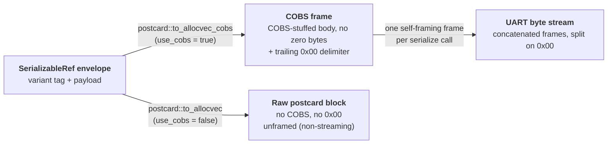
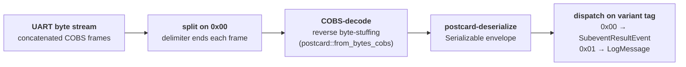

# Wire-format specification

This document is the authoritative, byte-level wire-format contract for the
`mars-bluetooth-hci` → UART → decoder path. It is the **contract** underneath
[ecosystem.md](ecosystem.md) (the WHAT), [architecture.md](architecture.md) (the HOW), and
the two ADRs (the WHY): [ADR-0001](adr/0001-wire-format-postcard-cobs.md) (the wire-format
decision) and [ADR-0002](adr/0002-serialize-only-ffi.md) (the serialize-only FFI). Its
primary audience is a **third-party decoder author** and the closed-source
`mars-ranging-demo` decoder; a conforming decoder can be implemented from this document
together with the `postcard` encoding reference and the generated C header.

This document deliberately does **not** reproduce: the `postcard` primitive encoding rules
(see the [postcard crate docs](https://docs.rs/postcard/1.1.3/), referenced as the normative
source); Bluetooth Channel Sounding technology (see the
[Bluetooth SIG Channel Sounding overview](https://www.bluetooth.com/channel-sounding-tech-overview/));
the firmware's UART mechanism (see the
[sibling firmware architecture](https://github.com/Metirionic/mars-cs-nrf54l/blob/main/docs/architecture.md));
or the *rationale* for choosing postcard + COBS (see ADR-0001). It states the consequences of
those choices as they appear on the wire, and owns everything specific to this repo's types.

## Canonical status and audience

Because the downstream decoder (`mars-ranging-demo`) is closed-source, **this document is the
canonical contract** for the wire format. The closed-source evaluation-app decoder and any
third-party decoder MUST conform to the format defined here. This repo is encode-only and is
the authoritative source for the contract (ADR-0001); ADR-0001 owns the *why* (the decision),
this document owns the *what* (the byte-level layout, framing, and decode procedure).

## The envelope

The unit of serialization is the externally-tagged `SerializableRef` / `Serializable` enum
defined in `mars-bluetooth-hci/src/libc.rs:23-45`. It has two variants:

- `SubeventResultEvent` — a CS subevent result (declaration index 0).
- `LogMessage` — a firmware log message, borrowing a C string (declaration index 1).

`SerializableRef` (borrowing, serialize-only, used by the FFI) and `Serializable` (owning,
deserializable, `#[cfg(feature = "std")]`) produce an **identical wire format**, asserted by
the `log_message_wire_format_matches` test (`libc.rs:78-84`). A decoder deserializes into the
owning `Serializable` enum and dispatches on the variant.

The frame begins **directly with the variant tag** — there is no outer length prefix, no magic
byte, and no version field before it.

### Variant tags

The variant tag is the serde declaration-order index, encoded by postcard as a varint `u32`
via `serialize_newtype_variant` (postcard `src/ser/serializer.rs:246-259`: it pushes
`try_push_varint_u32(variant_index)` then serializes the wrapped value). Both indices are below
128, so each tag is a single byte.

| Wire tag | Variant | Payload | Source |
|---|---|---|---|
| `0x00` | `SubeventResultEvent` | the struct's fields, concatenated in declaration order | `libc.rs:27`, `41` |
| `0x01` | `LogMessage` | varint byte-length prefix + raw UTF-8 bytes (`&str`) | `libc.rs:30`, `44` |

### No in-band version or magic byte

The envelope carries **no version field, no magic byte, and no outer length prefix**. The
first byte of every frame is the variant tag. The only `version` / `BINARY_FORMAT_VERSION` in
this repo (`mars-common/src/serde.rs`) belongs to a *separate* recording-file container
(`BinaryData`) for timestamped raw blobs — it is not part of this envelope. Versioning is
handled out-of-band; see [Versioning and compatibility](#versioning-and-compatibility) below.

## Encoding: postcard + COBS

### postcard binary encoding

Payloads are encoded with [`postcard`](https://docs.rs/postcard/1.1.3/) v1.1.3 (`Cargo.lock`)
as the `serde` binary format. **postcard is the normative reference for primitive byte-level
encoding**; the table below is a non-normative courtesy summary. A decoder implementing
postcard's rules directly will encode these identically.

| Rust type | postcard encoding (non-normative) |
|---|---|
| `u8` / `i8` / `bool` | 1 byte (`bool` = `0x00` / `0x01`; `i8` = raw two's-complement byte) |
| `u16` / `u32` / `u64` / `u128` / `usize` | LEB128-style varint, 7 bits/byte, little-endian, high bit = continuation; values `< 128` take 1 byte |
| `i16` / `i32` / `i64` / `i128` | zig-zag encoded, then varint |
| `f32` | 4 bytes, little-endian IEEE-754 |
| `f64` | 8 bytes, little-endian IEEE-754 |
| `&str` | varint byte-length prefix + raw UTF-8 bytes (postcard `serializer.rs:184-191`) |

Two structural rules load-bearing for this format:

- **Structs have no header.** postcard's `serialize_struct` writes no struct name, no field
  count, and no field names — a struct is the concatenation of its fields' encodings in
  declaration order (postcard `serializer.rs:303-305`, `516-526`).
- **`local_mac` / `peer_mac` are `u64` varints, not fixed 6-byte MACs.** A 48-bit MAC value
  takes 7 bytes on the wire; the default `0` takes 1 byte. A decoder must not assume a fixed
  width for these fields.

### COBS byte-stuffing and the trailing 0x00 delimiter

The `use_cobs=true` path encodes with `postcard::to_allocvec_cobs`
(`mars-bluetooth-hci/src/libc.rs:53`, `68`), which fuses serde serialization, COBS
byte-stuffing, and a trailing `0x00` sentinel into a single call. COBS guarantees the encoded
body contains **no zero bytes** (postcard `src/ser/flavors.rs:508-510`); the trailing `0x00`
is appended by postcard's `Cobs` flavor `finalize` (`flavors.rs:561-566`; `src/ser/mod.rs:233`
— "The terminating sentinel `0x00` byte is included in the output"). It is therefore the
**only** zero byte in the frame, which makes each frame self-framing on a UART: a receiver can
split the stream on `0x00` without ambiguity. (postcard's own doctest
`to_allocvec_cobs(&true)` == `&[0x02, 0x01, 0x00]` at `mod.rs:241` shows the trailing zero.)

> **Do not confuse this with the standalone `cobs` crate.** The `new_dummy_data` bring-up
> helper (`mars-common/src/libc/serialize.rs:83-90`) uses `cobs::encode_vec`, which performs
> COBS byte-stuffing but does **not** append a trailing `0x00`. That is a different code path
> used only for test/dummy data, not the HCI→UART path described here.

### Frame layout diagram



## Framing variants

### use_cobs=true (streaming / UART)

This is the production path. One FFI serialize call produces exactly one complete,
self-framing frame:

```
[ COBS-encoded( [variant tag] [payload] ) ] [0x00]
```

The COBS body contains no zero bytes; the trailing `0x00` terminates the frame. The firmware
writes the returned buffer to UART and then frees it with `drop_bin` (see
[architecture.md](architecture.md) §Serialization flow).

### use_cobs=false (unframed / non-streaming)

The `use_cobs=false` path uses `postcard::to_allocvec` (`libc.rs:55`, `70`): plain postcard
with **no COBS, no `0x00`, and no framing**. The bytes are simply:

```
[variant tag] [payload]
```

This is a deliberate unframed variant for non-streaming / recording use (ADR-0001 owns the
rationale). Because there is no delimiter, the consumer must know the frame boundary
out-of-band — for example from a recording-file container that carries a length, or from a
single known-length block. It is not self-framing and must not be concatenated onto a UART
stream expecting `0x00`-delimited frames.

## Stream model and decode contract

### Concatenated stream

The UART stream is a concatenation of `use_cobs=true` frames, each terminated by `0x00`. There
is **no framing or concatenation loop in Rust**: one serialize call produces one complete frame
(`libc.rs:49-56`), and the stream is formed by the firmware writing successive frames to UART.
The decoder splits the stream on the trailing `0x00` delimiter.

### Decode flow diagram



### Decode contract

A conforming decoder implements the following per-frame procedure:

1. **Split** the stream on `0x00` delimiters. Each non-empty segment between delimiters is one
   frame's COBS body. (Empty segments and a possible trailing partial frame after the last
   `0x00` are ignored until complete.)
2. **COBS-decode** each segment — reverse the byte-stuffing — equivalent to
   `postcard::from_bytes_cobs`.
3. **postcard-deserialize** the decoded bytes into the `Serializable` envelope.
4. **Dispatch** on the leading variant tag: `0x00` → `SubeventResultEvent`, `0x01` →
   `LogMessage`.

The encode side is exercised by the round-trip test at `libc.rs:94-100`
(`to_allocvec_cobs` / `from_bytes_cobs`). This repo is **encode-only**; the decode side runs
in the closed-source `mars-ranging-demo` GUI binary, which is why this document — not that
repo — is the authoritative contract.

## Payloads

### SubeventResultEvent (tag 0x00)

The payload is the `SubeventResultEvent` struct
(`mars-bluetooth-hci/src/event/hci_le_cs/subevent_result.rs:184-235`), serialized as its fields
concatenated in declaration order (no struct header). The 15 top-level fields, in wire order:

| # | Field | Type | Encoding note |
|---|---|---|---|
| 1 | `origin` | `Origin` (enum) | varint tag, declaration order (see [Decoder notes](#enum-tags-are-declaration-order-not-c-repr-discriminants)) |
| 2 | `local_mac` | `u64` | varint; **not** a fixed 6-byte MAC |
| 3 | `peer_mac` | `u64` | varint; **not** a fixed 6-byte MAC |
| 4 | `connection_handle` | `u16` | varint |
| 5 | `config_id` | `u8` | 1 byte |
| 6 | `has_config_id` | `bool` | 1 byte |
| 7 | `procedure_done_status` | `DoneStatus` (enum) | varint tag, declaration order |
| 8 | `procedure_abort_reason` | `ProcedureAbortReason` (enum) | varint tag, declaration order |
| 9 | `subevent_done_status` | `DoneStatus` (enum) | varint tag, declaration order |
| 10 | `subevent_abort_reason` | `SubeventAbortReason` (enum) | varint tag, declaration order |
| 11 | `antenna_path_count` | `usize` | varint |
| 12 | `step_count` | `usize` | varint |
| 13 | `steps` | `[Step; 160]` | **no length prefix** — 160 `Step`s back-to-back (see [Decoder notes](#array-encoding-asymmetry)) |
| 14 | `initial_meta` | `InitialMeta` (struct) | fields concatenated in declaration order |
| 15 | `has_initial_meta` | `bool` | 1 byte |

For the **full nested field-level layout** of `Step`, `ModeRoleSpecificInfo`, `Mode2`,
`PhaseCorrectionTerm`, `InitialMeta`, `FrequencyCompensation`, and `ReferencePowerLevel`, see
the generated C header [`mars-bluetooth-hci/mars_bluetooth_hci.h`](../mars-bluetooth-hci/mars_bluetooth_hci.h)
(`SubeventResultEvent_t` and the types it references). The header is the canonical source for
field **order** and field **types**, which match the postcard declaration order.

> **Header caveat — the header shows C-ABI values, not wire values.** The generated header
> reflects `#[repr(C)]` struct layout and `#[repr(u8)]` enum discriminants, which are the
> values used across the C FFI, **not** the postcard wire values. Specifically:
> - Integers on the wire are postcard varints (e.g. a `u64` field is 1–10 bytes), with **no
>   struct padding** — the header's fixed C sizes and padding do not apply.
> - Enum wire values are the serde declaration-order indices, **not** the `#[repr(u8)]`
>   discriminants shown in the header (e.g. the header shows `DoneStatus::Aborted = 0x0F`, but
>   the wire value is `0x02`). See
>   [Decoder notes](#enum-tags-are-declaration-order-not-c-repr-discriminants).
>
> Use the header for field order and types; use this document and the `postcard` reference for
> how each field is encoded.

The identity fields `origin`, `local_mac`, and `peer_mac` are **caller-set out-of-band**, not
derived from the HCI bytes: the parser leaves them at their defaults (`Origin::Unknown` / `0`)
and the caller fills them from context (in Path A the firmware sets all three in C before
serializing). See [architecture.md](architecture.md) §Known limitations.

### LogMessage (tag 0x01)

There is no struct — the variant wraps a borrowed `&str`. After the `0x01` tag, the payload is
postcard's `serialize_str` encoding: a varint byte-length prefix followed by the raw UTF-8
bytes (`postcard serializer.rs:184-191`). The `#[serde(borrow)]` attribute on this variant
(`libc.rs:29`, `43`) is a zero-copy deserialization hint and does not affect the wire format.

## Decoder notes (non-obvious encoding facts)

These facts are specific to this repo's types and are **not** documented by `postcard` or the
generated C header. A decoder that misses them will misdecode even with a correct postcard
implementation.

### Array-encoding asymmetry

postcard has two array-encoding paths — `serialize_tuple` (no length prefix, no end marker)
and `serialize_seq` (a varint length prefix) — and which path a given array takes is
determined by whether the field carries a `serde_with` `[_; N]` Array adapter, which is
invisible at the postcard level and invisible in the C header. `SubeventResultEvent` contains
**both** kinds:

- **`steps: [Step; 160]`** carries `#[serde_as(as = "[_; MAX_NUM_STEPS_REPORTED]")]`
  (`subevent_result.rs:228`; `MAX_NUM_STEPS_REPORTED = 160`, `constants.rs:54`). The
  `serde_with` Array adapter routes through `serialize_tuple`, so the 160 `Step`s are emitted
  **back-to-back with no length prefix and no end marker** (postcard `serializer.rs:269-271`).
- **`Mode2`'s three arrays** — `phase_correction_terms: [PhaseCorrectionTerm; 5]`,
  `quality_indicators: [ToneQualityIndicator; 5]`, and `extension_slots: [ExtensionSlot; 5]`
  (`subevent_result.rs:59-63`; `MAX.ANTENNA_PATH_COUNT + 1 = 5`, `constants.rs:56`) — have
  **no** `#[serde_as]` (the `Mode2` struct at `subevent_result.rs:52-64` does not declare
  one). They take serde's default array path through `serialize_seq`, so each is emitted as a
  **varint `5` length prefix followed by 5 elements** (postcard `serializer.rs:262-266`).

A decoder MUST treat these two array kinds differently. Assuming a uniform encoding
misdecodes: a spurious "length" byte read before `steps` would be interpreted as the first
`Step.mode` and desynchronize all 160 steps; conversely, omitting the length prefix on a
`Mode2` array would misalign every element that follows.

### Enum tags are declaration order, not C-repr discriminants

Every nested enum in this format declares `#[repr(u8)]` (with `#[derive_ReprC]` for the C
ABI) but **none** declares `#[serde(tag = ...)]`. serde therefore ignores any explicit `=
0xNN` discriminants and emits the variant as a postcard varint of the **serde declaration
order index**. The `#[repr(u8)]` discriminants are C-ABI values only and are **not** the wire
values.

Worked example — `DoneStatus` (`mars-bluetooth-hci/src/event/mod.rs:101-110`):

| Variant | `#[repr(u8)]` discriminant (C ABI, shown in header) | Wire value (serde declaration order) |
|---|---|---|
| `AllComplete` | `0x00` | `0x00` |
| `Partial` | `0x01` | `0x01` |
| `Aborted` | `0x0F` | `0x02` |
| `Reserved` | `0xFF` | `0x03` |

The first two coincide by accident, which makes the trap easy to miss: a decoder that reads
the header and maps `Aborted` → `0x0F` will be correct for `AllComplete`/`Partial` and wrong
for `Aborted`/`Reserved`. The same declaration-order rule applies to `Origin`,
`ProcedureAbortReason`, `SubeventAbortReason`, `ToneQualityIndicator`, `ExtensionSlot`, and
`ModeRoleSpecificInfoKind`.

A particularly subtle case: `ModeRoleSpecificInfoKind::Mode2` is declaration index **5**, so
its wire value is `0x05` (`subevent_result.rs:97-119`). This is **distinct from** the HCI
constant `step_mode::MODE_2 = 0x02` (`constants.rs:46`), which is the raw value that fills the
`Step.mode: u8` field. Both values appear in the same `Step` struct — `mode` = `0x02` (a raw
`u8`) followed by `info.kind` = `0x05` (the enum tag) — and must not be conflated. (The
`ModeRoleSpecificInfoKind` enum enumerates every mode/role variant for C-ABI forward
compatibility; only `Mode2` is populated by the parser today — see
[architecture.md](architecture.md) §Known limitations and issue #9.)

## Versioning and compatibility

There is **no in-band version field or magic byte** in the wire format. Compatibility is
managed by **git-tag pinning** of the library together with paired evaluation-app releases:
the firmware consumes `mars-bluetooth-hci` via CMake `FetchContent` pinned to a tagged release
(the pin lives in `mars-cs-nrf54l`), and the evaluation app is released in lockstep. A decoder
is conformant with a specific library release when the library and the decoder are pinned to
compatible tags.

Whether to introduce an in-band version or magic byte for forward compatibility is an **open
follow-up** (issue #15), which this specification unblocks. This document states the current
contract and does not pre-empt that decision; any future change to the envelope layout would
be a wire-format-breaking change governed by the same tag-co-pinning model until an in-band
version mechanism exists.

## Related documents

- [ecosystem.md](ecosystem.md) — the three-repo WHAT and the ecosystem data-flow diagram.
- [architecture.md](architecture.md) — the HOW: encode/decode sides, the serialize-only FFI surface, the two event-struct construction paths, and the end-to-end HCI→UART sequence diagram (this document is the byte-level CONTRACT underneath it).
- [adr/0001-wire-format-postcard-cobs.md](adr/0001-wire-format-postcard-cobs.md) — the WHY: the postcard + COBS decision, the `0x00` sentinel, the `use_cobs=false` unframed variant, and the encode-only / decode-closed boundary.
- [adr/0002-serialize-only-ffi.md](adr/0002-serialize-only-ffi.md) — the serialize-only C FFI decision.
- [../CONTRIBUTING.md](../CONTRIBUTING.md) §6 — the documentation structure and Mermaid convention.
- [../mars-bluetooth-hci/mars_bluetooth_hci.h](../mars-bluetooth-hci/mars_bluetooth_hci.h) — the generated C header; canonical source for field order and types (note the C-ABI ≠ wire caveat in [Payloads](#subeventresultevent-tag-0x00) and [Decoder notes](#enum-tags-are-declaration-order-not-c-repr-discriminants)).
- [postcard crate docs](https://docs.rs/postcard/1.1.3/) — the normative reference for primitive byte-level encoding.
- [mars-cs-nrf54l docs/architecture.md](https://github.com/Metirionic/mars-cs-nrf54l/blob/main/docs/architecture.md) — the firmware's internal ranging-data flow and UART mechanism (deferred).
- [Bluetooth SIG Channel Sounding overview](https://www.bluetooth.com/channel-sounding-tech-overview/) — the technology background this document deliberately does not reproduce.